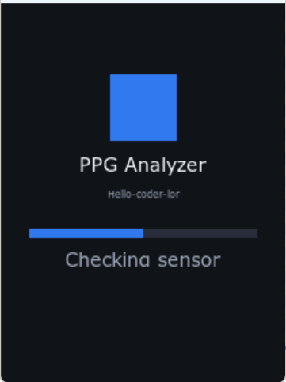
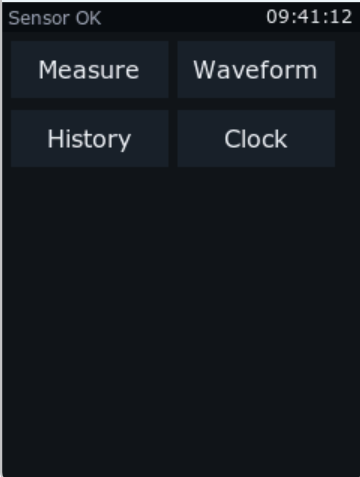
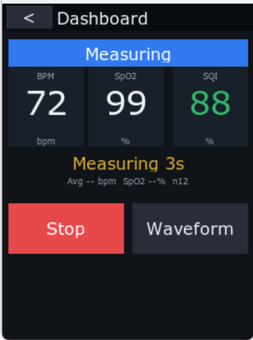
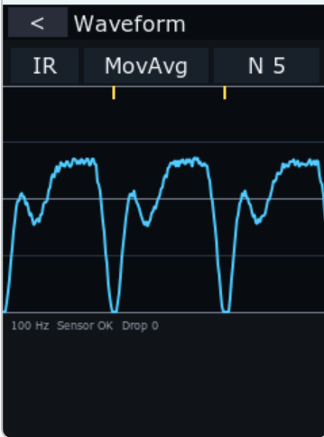
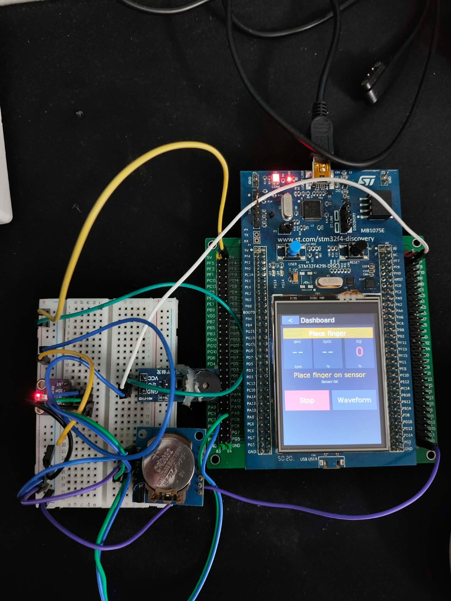

# BÁO CÁO ĐỒ ÁN - MÔN HỆ NHÚNG

---

## GIỚI THIỆU

### Đề bài / Mục tiêu sản phẩm

- Sử dụng STM32F429 và TouchGFX.
- Liên tục lấy giá trị nhịp tim và SpO₂. 
- Hiển thị 2 thông số này lên màn hình ở với nhiều kiểu hiển thị. Bấm nút B1 để hoán đổi giữa các kiểu hiển thị này:
   - Màn hình 1: hiển thị giá trị real-time dạng số: 
   - Màn hình 2: đồ thị line.
- Luôn luôn truyền dữ liệu realtime qua USART về máy tính.
- Sử dụng ngưỡng cố định để cảnh báo khi nhịp tim hoặc SpO₂ thấp hơn ngưỡng y tế cho phép.
- Hệ thống liên tục kiểm tra xem nhịp tim và O₂ có vượt ngưỡng không. Nếu vượt thì nháy 2 đèn led PG13, PG14.

### Hướng tiếp cận

Hệ thống sử dụng cảm biến quang học MAX30102 để thu tín hiệu PPG từ ngón tay người dùng. Dữ liệu RED và IR thô được truyền về vi điều khiển STM32 thông qua giao tiếp I2C, sau đó được đưa vào khối xử lý tín hiệu số DSP.

Tại khối DSP, tín hiệu được loại bỏ thành phần DC và lọc nhiễu bằng các bộ lọc như trung bình trượt, trung vị và Butterworth thông thấp. Sau khi tín hiệu ổn định, hệ thống phát hiện các đỉnh PPG để tính nhịp tim BPM, đồng thời sử dụng thuật toán ratio-of-ratios để ước lượng SpO₂. Chất lượng tín hiệu được đánh giá thông qua chỉ số SQI.

Các kết quả BPM, SpO₂, SQI và dạng sóng PPG được hiển thị trực tiếp trên màn hình LCD thông qua giao diện TouchGFX. Hệ điều hành FreeRTOS được sử dụng để chia hệ thống thành nhiều tác vụ chạy song song, gồm thu thập dữ liệu cảm biến, xử lý tín hiệu, cập nhật giao diện và truyền dữ liệu telemetry qua UART. Cách tổ chức này giúp hệ thống hoạt động ổn định và đáp ứng tốt yêu cầu thời gian thực.

### Sản phẩm

1. **Đo nhịp tim (BPM):** Hệ thống nhận diện các đỉnh trong tín hiệu PPG để tính khoảng RR, sau đó ước lượng nhịp tim trong phạm vi 40-200 BPM.

2. **Đo nồng độ oxy trong máu (SpO₂):** Sử dụng dữ liệu RED và IR từ cảm biến MAX30102, áp dụng thuật toán ratio-of-ratios trên cửa sổ trượt 4 giây để ước lượng SpO2 trong phạm vi 70-100%.

3. **Đánh giá chất lượng tín hiệu (SQI):** Tính toán chỉ số chất lượng tín hiệu từ 0-100%, hỗ trợ phân loại mức tín hiệu thành Poor, Fair và Good để người dùng biết độ tin cậy của phép đo.

4. **Hiển thị sóng PPG thời gian thực:** Giao diện hiển thị dạng sóng PPG với 240 điểm dữ liệu, cho phép quan sát tín hiệu trực tiếp, chọn kênh IR/RED và thay đổi chế độ lọc tín hiệu.

5. **Lưu lịch sử đo:** Sau mỗi phiên đo hợp lệ, kết quả được lưu tạm thời trong bộ nhớ RAM dạng vòng, kèm thời gian đo lấy từ module RTC DS1307.

6. **Cảnh báo y tế:** Hệ thống theo dõi các ngưỡng bất thường như BPM thấp, BPM cao hoặc SpO₂ thấp. Cảnh báo chỉ được kích hoạt khi giá trị vượt ngưỡng trong một khoảng thời gian xác nhận nhằm tránh báo sai do nhiễu tín hiệu.

7. **Phản hồi âm thanh:** Buzzer PWM phát các giai điệu khác nhau cho từng trạng thái như khởi động, đo hoàn tất, phép đo không hợp lệ hoặc cảnh báo bất thường.

**Ảnh chụp minh họa:**
<table align="center">
  <tr>
    <td align="center">
      <b>Màn hình khởi động</b><br><br>
      <br><br>
      Hiển thị khi thiết bị được cấp nguồn và khởi tạo hệ thống.
    </td>
    <td align="center">
      <b>Màn hình chính</b><br><br>
      <br><br>
      Cung cấp các chức năng điều hướng chính.
    </td>
  </tr>
 <br><br>
  <tr>
    <td align="center">
      <b>Màn hình hiển thị chỉ số</b><br><br>
      <br><br>
      Hiển thị BPM, SpO₂ và SQI theo thời gian thực.
    </td>
    <td align="center">
      <b>Màn hình sóng PPG</b><br><br>
      <br><br>
      Hiển thị dạng sóng PPG theo thời gian thực.
    </td>
  </tr>
</table>

---
## TÁC GIẢ
- Tên nhóm: **HELLO**
- Thành viên trong nhóm:
  |STT|Họ tên|MSSV|Công việc|
  |--:|--|--|--|
  |1|Vũ Thu Huyền|20235348|Hiển thị LCD, xây dựng giao diện, hiệu ứng chuyển màn hình, xử lý ngắt nút nhấn, viết báo cáo và tổng hợp kết quả|
  |2|Trần Tuấn Anh|20235266|Lập trình đọc cảm biến MAX30102, giao tiếp I2C, cấu hình FIFO, lấy dữ liệu RED/IR thô|
  |3|Nguyễn Trần Gia Phụng|20235402|Xử lý tín hiệu PPG, lọc nhiễu, phát hiện đỉnh, tính BPM, SpO2 và SQI|
  |4|Nguyễn Thị Tuyết Mai|20235369|Xây dựng luồng FreeRTOS, quản lý task, queue dữ liệu, đồng bộ I2C, xử lý RTC DS1307 và lưu lịch sử đo|
  |5|Nguyễn Thanh Hương|20235343|Lập trình cảnh báo LED/buzzer, truyền telemetry UART |


## MÔI TRƯỜNG HOẠT ĐỘNG

### Phần cứng

- **Vi điều khiển:** Sử dụng STM32F429ZIT6 trên board STM32F429I-DISCO REV D01. Đây là vi điều khiển ARM Cortex-M4 chạy ở tần số tối đa 180 MHz, phù hợp cho các tác vụ xử lý tín hiệu, điều khiển ngoại vi và hiển thị giao diện đồ họa.

- **Cảm biến MAX30102:** Cảm biến quang học dùng để thu tín hiệu PPG từ ngón tay người dùng. Cảm biến cung cấp dữ liệu hai kênh RED và IR, phục vụ cho việc tính nhịp tim BPM và nồng độ oxy trong máu SpO2.

- **Module RTC DS1307:** Dùng để lưu và cung cấp thời gian thực cho hệ thống. Thời gian từ RTC được sử dụng để gắn timestamp cho các bản ghi lịch sử đo.

- **RAM ngoài SDRAM:** SDRAM được kết nối qua FMC Bank 2 với bus dữ liệu 16-bit, dùng làm bộ nhớ đệm khung hình cho giao diện TouchGFX.

- **Màn hình LCD:** Màn hình ILI9341 TFT LCD kích thước 240x320 px, định dạng màu RGB565, giao tiếp với vi điều khiển thông qua LTDC để hiển thị giao diện người dùng và dạng sóng PPG.

- **Buzzer:** Buzzer thụ động được điều khiển bằng tín hiệu PWM, dùng để phát âm thanh phản hồi khi khởi động, đo xong, phép đo không hợp lệ hoặc có cảnh báo.

- **LED cảnh báo:** Sử dụng các LED có sẵn trên board để hiển thị trạng thái cảnh báo khi nhịp tim hoặc SpO2 vượt ngưỡng cấu hình.

### Danh mục linh kiện (Bill of Materials)

| STT | Tên linh kiện | Ý nghĩa |
| --: | -- | -- |
| 1 | STM32F429I-DISCO | Board phát triển chính của hệ thống, tích hợp vi điều khiển STM32F429ZIT6, màn hình LCD, SDRAM và LED trạng thái. |
| 2 | MAX30102 | Cảm biến quang học dùng để thu tín hiệu PPG từ ngón tay, phục vụ tính toán nhịp tim BPM và nồng độ oxy trong máu SpO2. |
| 3 | DS1307 | Module đồng hồ thời gian thực, dùng để cung cấp thời gian cho hệ thống và gắn timestamp cho các bản ghi lịch sử đo. |
| 4 | Buzzer thụ động | Thiết bị phát âm thanh phản hồi, dùng cho các trạng thái như khởi động, đo hoàn tất, phép đo không hợp lệ và cảnh báo. |

### Phần mềm

- **Hệ điều hành:** FreeRTOS V10.0.1 sử dụng thông qua lớp CMSIS-RTOS V2. FreeRTOS giúp chia hệ thống thành nhiều tác vụ chạy song song như đọc cảm biến, xử lý tín hiệu, cập nhật giao diện và truyền dữ liệu UART.

- **GUI Framework:** TouchGFX, thuộc gói X-CUBE-TOUCHGFX 4.26.1, được sử dụng để xây dựng giao diện đồ họa trên màn hình LCD. Giao diện gồm các màn hình như Home, Dashboard, Waveform, History và cài đặt thời gian.

- **Thư viện HAL:** STM32Cube FW_F4 V1.28.1 cung cấp các hàm điều khiển ngoại vi của STM32 như GPIO, I2C, UART, LTDC, DMA2D, FMC và SPI.

- **Ngôn ngữ lập trình:** Dự án sử dụng kết hợp C và C++. Các phần driver, xử lý tín hiệu DSP, task FreeRTOS và dịch vụ hệ thống được viết bằng C; phần giao diện TouchGFX và cầu nối dữ liệu GUI được viết bằng C++.

- **Môi trường phát triển:** STM32CubeIDE là môi trường chính để cấu hình phần cứng, build và nạp chương trình. Dự án cũng có cấu trúc hỗ trợ thêm cho Keil MDK-ARM và IAR EWARM.

---

## SƠ ĐỒ SCHEMATIC

### Bảng kết nối linh kiện

| STM32F429 Pin | Module ngoại vi | Chức năng |
| -- | -- | -- |
| **PA8** | MAX30102 / DS1307 | Chân SCL của giao tiếp I2C3, dùng chung cho cảm biến MAX30102 và module RTC DS1307. |
| **PC9** | MAX30102 / DS1307 | Chân SDA của giao tiếp I2C3, dùng chung cho cảm biến MAX30102 và module RTC DS1307. |
| **PA9** | UART Telemetry | Chân truyền dữ liệu USART1_TX, dùng để gửi dữ liệu telemetry ra máy tính với baudrate 921600. |
| **PA10** | UART Telemetry | Chân nhận dữ liệu USART1_RX, hỗ trợ giao tiếp UART với máy tính hoặc thiết bị ngoài. |
| **PF6** | Buzzer thụ động | Ngõ ra PWM từ TIM10_CH1, dùng để điều khiển buzzer phát âm thanh thông báo và cảnh báo. |
| **PA0** | Nút B1 trên board | Chân ngắt ngoài EXTI0, dùng để nhận thao tác nhấn nút vật lý trên board. |
| **PG13** | LED LD3 xanh lá | LED cảnh báo thứ nhất, được điều khiển để hiển thị trạng thái cảnh báo của hệ thống. |
| **PG14** | LED LD4 đỏ | LED cảnh báo thứ hai, hoạt động luân phiên với LED LD3 khi có cảnh báo bất thường. |

### Giao tiếp I2C3

Hệ thống sử dụng bus I2C3 để kết nối đồng thời cảm biến MAX30102 và module RTC DS1307. Hai thiết bị này dùng chung hai đường tín hiệu SCL và SDA, nhưng có địa chỉ I2C khác nhau nên vi điều khiển có thể phân biệt khi giao tiếp.

```text
STM32F429 (I2C3)
  ├── PA8 (SCL) ──┬── MAX30102 SCL  (địa chỉ 0x57)
  │                └── DS1307 SCL    (địa chỉ 0x68)
  │
  └── PC9 (SDA) ──┬── MAX30102 SDA
                   └── DS1307 SDA
```

> **Lưu ý:** MAX30102 và DS1307 dùng chung bus I2C3 tốc độ 100 kHz. Trong chương trình, việc truy cập bus được đồng bộ bằng mutex của FreeRTOS để tránh trường hợp hai tác vụ cùng sử dụng I2C tại một thời điểm.

### Giao tiếp LCD

Màn hình ILI9341 TFT LCD 240x320 px được điều khiển bằng giao tiếp LTDC để truyền dữ liệu hình ảnh dạng RGB565. Ngoài ra, SPI5 được sử dụng để gửi các lệnh cấu hình và khởi tạo thanh ghi cho màn hình.

```text
STM32F429 ── LTDC (song song RGB565) ── ILI9341 LCD 240x320
             SPI5 (PF7/PF8/PF9) ── LCD init registers
             PC1 (CS), PC2 (RESET), PD13 (D/C)
```

### Giao tiếp SDRAM

SDRAM ngoài được kết nối với STM32F429 thông qua bộ điều khiển FMC Bank 2 với bus dữ liệu 16-bit. Bộ nhớ này được sử dụng làm frame buffer cho TouchGFX, giúp lưu trữ dữ liệu khung hình khi hiển thị giao diện đồ họa trên LCD.

```text
STM32F429 ── FMC Bank 2 (16-bit) ── SDRAM MT48LC4M16A2
             PF0-PF5, PF11-PF15, PG0-PG1, PG4-PG5, PG8, PG15
             PD0-PD1, PD8-PD10, PD14-PD15, PE0-PE15, PC0, PB5-PB6
```

---

## TÍCH HỢP HỆ THỐNG

### Kiến trúc tổng thể

Hệ thống được tổ chức theo mô hình pipeline song song, trong đó mỗi nhóm chức năng chính được tách thành một tác vụ riêng. Cách thiết kế này giúp quá trình thu thập dữ liệu, xử lý tín hiệu, hiển thị giao diện và truyền dữ liệu UART có thể hoạt động độc lập nhưng vẫn phối hợp với nhau thông qua các cơ chế đồng bộ.

```text
┌─────────────┐     ┌─────────────┐     ┌─────────────┐     ┌─────────────┐
│ SensorTask  │────▶│   DspTask   │────▶│  GUI_Task   │     │ Telemetry   │
│ Thu thập    │     │ Xử lý       │     │ Hiển thị    │     │ UART        │
└─────────────┘     └─────────────┘     └─────────────┘     └─────────────┘
       │                   │                   │                    │
   MAX30102            DSP Filters          TouchGFX             USART1
   I2C FIFO          BPM/SpO2/SQI         LCD 240x320        921600 baud
```

Dữ liệu được lấy từ cảm biến MAX30102, sau đó đưa qua hàng đợi đến khối xử lý DSP. Kết quả sau xử lý được công bố cho giao diện TouchGFX để hiển thị lên LCD. Song song với đó, các dữ liệu đo, trạng thái hệ thống và sự kiện cảnh báo được định dạng và truyền ra ngoài thông qua UART telemetry.

### Thành phần phần cứng và vai trò

| Thành phần | Vai trò |
| -- | -- |
| **STM32F429ZIT6** | Vi điều khiển trung tâm của hệ thống, đảm nhiệm việc điều phối các ngoại vi, chạy FreeRTOS, xử lý tín hiệu và điều khiển giao diện hiển thị. |
| **MAX30102** | Cảm biến quang học PPG, sử dụng LED đỏ và hồng ngoại để thu tín hiệu phản xạ từ ngón tay, phục vụ tính BPM và SpO2. |
| **DS1307** | Module đồng hồ thời gian thực, cung cấp thời gian cho hệ thống và timestamp cho các bản ghi lịch sử đo. |
| **ILI9341 LCD** | Màn hình LCD TFT 240x320 px, dùng để hiển thị giao diện đồ họa, thông số đo và dạng sóng PPG. |
| **SDRAM** | Bộ nhớ ngoài dùng làm frame buffer cho TouchGFX, hỗ trợ hiển thị đồ họa trên LCD. |
| **Buzzer** | Thiết bị phát âm thanh thông báo, dùng cho các trạng thái như khởi động, đo xong, đo không hợp lệ và cảnh báo. |
| **LED LD3/LD4** | Hai LED cảnh báo trên board, nhấp nháy luân phiên khi hệ thống phát hiện BPM hoặc SpO2 vượt ngưỡng. |

### Thành phần phần mềm và vai trò

| Thành phần | Vị trí | Vai trò |
| -- | -- | -- |
| **SensorTask** | `Application/app_init.c` | Đọc FIFO của MAX30102 theo chu kỳ, đưa mẫu RED/IR thô vào hàng đợi cho DSP, đồng thời xử lý RTC, buzzer và LED cảnh báo. |
| **DspTask** | `Application/dsp_task.c` | Nhận dữ liệu thô từ hàng đợi, chạy engine PPG, tính BPM, SpO2, SQI, cập nhật cảnh báo, lưu lịch sử và công bố kết quả cho GUI. |
| **GUI_Task** | `TouchGFX framework` | Render giao diện người dùng, đọc snapshot kết quả đo từ DSP và hiển thị lên LCD. |
| **TelemetryTask** | `Telemetry/telemetry_service.c` | Nhận các thông điệp telemetry, định dạng thành CSV và gửi ra ngoài qua USART1. |
| **MAX30102 Driver** | `Drivers/MAX30102/` | Cấu hình cảm biến MAX30102, thiết lập FIFO, chế độ SpO2 và đọc dữ liệu RED/IR thô qua I2C. |
| **DS1307 Driver** | `Drivers/DS1307/` | Đọc và ghi thời gian thực từ module DS1307 qua I2C, chuyển đổi dữ liệu dạng BCD sang thời gian hệ thống. |
| **DSP Filters** | `DSP/` | Cung cấp các bộ lọc tín hiệu như Moving Average, Median và Lowpass Butterworth để làm mượt tín hiệu PPG. |
| **PPG Engine** | `DSP/ppg_measurement.c` | Quản lý trạng thái đo, phát hiện ngón tay, ổn định tín hiệu, phát hiện đỉnh PPG và tính BPM. |
| **SpO2 Estimator** | `DSP/spo2_estimator.c` | Ước lượng SpO2 từ dữ liệu RED/IR bằng thuật toán ratio-of-ratios trên cửa sổ trượt. |
| **Medical Alert** | `Application/medical_alert_service.c` | Kiểm tra ngưỡng BPM thấp, BPM cao và SpO2 thấp; sử dụng cơ chế xác nhận theo thời gian để tránh cảnh báo sai. |
| **TouchGFX GUI** | `TouchGFX/gui/` | Xây dựng các màn hình giao diện như Boot, Home, Dashboard, Waveform, History và DateTime Settings. |
| **Application Bridge** | `Application/application_gui_bridge.cpp` | Là lớp trung gian giữa phần xử lý DSP và giao diện TouchGFX, chuyển đổi dữ liệu `PpgResult` thành snapshot cho GUI. |

### Đồng bộ hóa giữa các luồng

| Cơ chế | Vị trí | Mục đích |
| -- | -- | -- |
| **I2C3 Mutex** | `Application/app_init.c` | Đồng bộ truy cập bus I2C3 giữa MAX30102 và DS1307, tránh hai thao tác I2C xảy ra cùng lúc. |
| **PpgQueue SPSC** | `Utilities/ppg_sample_queue.c` | Hàng đợi một producer, một consumer dùng để chuyển mẫu PPG thô từ SensorTask sang DspTask mà không cần khóa nặng. |
| **Seqlock** | `Application/dsp_task.c` | Cho phép DspTask ghi kết quả và GUI đọc kết quả một cách an toàn, tránh đọc phải dữ liệu đang ghi dở. |
| **History Mutex** | `Application/dsp_task.c` | Bảo vệ vùng dữ liệu lịch sử đo khi DspTask ghi và GUI đọc cùng lúc. |
| **Atomic Word** | `Application/dsp_task.c` | Truyền yêu cầu đổi chế độ lọc hoặc cửa sổ lọc từ GUI sang DspTask bằng các biến nguyên đơn giản. |

## ĐẶC TẢ HÀM

### 1. Hàm khởi tạo cảm biến MAX30102

```c
/**
 * Khởi tạo cảm biến MAX30102 ở chế độ SpO2.
 * Cấu hình FIFO, tốc độ lấy mẫu, độ phân giải ADC và dòng LED RED/IR.
 *
 * @param hi2c Con trỏ đến I2C handle dùng để giao tiếp với MAX30102.
 * @return MAX30102_OK nếu thành công, hoặc mã lỗi nếu cảm biến không phản hồi,
 *         sai PART_ID, lỗi I2C hoặc tham số không hợp lệ.
 */
Max30102Status MAX30102_Init(I2C_HandleTypeDef* hi2c);
```

### 2. Hàm đọc FIFO MAX30102

```c
/**
 * Đọc các mẫu RED/IR thô từ FIFO của MAX30102.
 * Mỗi mẫu gồm 6 byte: 3 byte RED và 3 byte IR, sau đó được đưa về giá trị 18-bit.
 *
 * @param samples   Mảng đầu ra chứa các mẫu đọc được.
 * @param maxSamples Số mẫu tối đa cho phép đọc trong một lần gọi.
 * @param readCount Con trỏ lưu số mẫu thực tế đã đọc.
 * @return MAX30102_OK nếu đọc thành công, hoặc mã lỗi tương ứng.
 */
Max30102Status MAX30102_ReadFifo(Max30102Sample* samples,
                                 uint8_t maxSamples,
                                 uint8_t* readCount);
```

### 3. Hàm đưa mẫu PPG vào engine xử lý

```c
/**
 * Nhận một mẫu PPG thô từ SensorTask và cập nhật state machine đo.
 * Hàm thực hiện phát hiện ngón tay, ổn định tín hiệu, trừ baseline DC,
 * lọc tín hiệu, phát hiện đỉnh và cập nhật dữ liệu BPM/SpO2/SQI nội bộ.
 *
 * @param sample Con trỏ đến mẫu PPG thô gồm sequence, timestampMs, redRaw và irRaw.
 */
void Ppg_PushSample(const PpgRawSample* sample);
```

### 4. Hàm lấy kết quả đo PPG

```c
/**
 * Sao chép kết quả đo hiện tại từ engine PPG ra ngoài.
 * Kết quả gồm trạng thái đo, BPM, SpO2, SQI, waveform, số peak,
 * dữ liệu raw/filtered và thông tin phiên đo.
 *
 * @param out Con trỏ đến biến PpgResult nhận dữ liệu đầu ra.
 */
void Ppg_GetResult(PpgResult* out);
```

### 5. Hàm tính SpO2

```c
/**
 * Xử lý mẫu RED/IR thô để ước lượng SpO2 bằng thuật toán ratio-of-ratios.
 * Dữ liệu được gom theo các block 1 giây và tính trên cửa sổ trượt 4 giây.
 *
 * @param est         Trạng thái bộ ước lượng SpO2.
 * @param redRaw      Giá trị RED thô từ cảm biến.
 * @param irRaw       Giá trị IR thô từ cảm biến.
 * @param timestampMs Thời điểm lấy mẫu, đơn vị mili giây.
 * @param out         Con trỏ nhận kết quả SpO2, ratio, DC và AC.
 * @return SPO2_STATUS_OK nếu có kết quả hợp lệ, SPO2_STATUS_NOT_READY nếu chưa đủ dữ liệu,
 *         hoặc SPO2_STATUS_INVALID_SIGNAL nếu tín hiệu không đạt yêu cầu.
 */
Spo2Status Spo2_Process(Spo2Estimator* est,
                        uint32_t redRaw,
                        uint32_t irRaw,
                        uint32_t timestampMs,
                        Spo2Result* out);
```

### 6. Hàm lọc trung bình trượt

```c
/**
 * Áp dụng bộ lọc trung bình trượt cho tín hiệu đầu vào.
 * Bộ lọc dùng buffer vòng và tổng chạy nên có độ phức tạp O(1) cho mỗi mẫu.
 *
 * @param filter Trạng thái bộ lọc moving average.
 * @param input  Giá trị đầu vào.
 * @param output Con trỏ nhận giá trị sau khi lọc.
 * @return MOVING_AVERAGE_STATUS_OK khi cửa sổ đã đầy,
 *         MOVING_AVERAGE_STATUS_NOT_READY khi chưa đủ mẫu.
 */
MovingAverageStatus MovingAverage_Process(MovingAverageFilter* filter,
                                          int32_t input,
                                          int32_t* output);
```

### 7. Hàm lọc thông thấp Butterworth

```c
/**
 * Áp dụng bộ lọc thông thấp Butterworth bậc 2 cho tín hiệu PPG.
 * Bộ lọc dùng cấu trúc Direct Form II Transposed, phù hợp cho hệ thống nhúng.
 *
 * @param f     Trạng thái bộ lọc lowpass.
 * @param input Giá trị tín hiệu đầu vào.
 * @return Giá trị tín hiệu sau khi lọc.
 */
int32_t Lowpass_Process(LowpassFilter* f, int32_t input);
```

### 8. Hàm cập nhật cảnh báo y tế

```c
/**
 * Cập nhật trạng thái cảnh báo dựa trên BPM, SpO2 và trạng thái đo hiện tại.
 * Cảnh báo chỉ được xét khi hệ thống đang đo, tín hiệu ổn định và giá trị hợp lệ.
 * Các ngưỡng được cấu hình trong alert_config.h.
 *
 * @param update Dữ liệu đo hiện tại gồm BPM, SpO2, cờ hợp lệ, trạng thái đo và timestamp.
 */
void MedicalAlert_Update(const MedicalMeasurementUpdate* update);
```

### 9. Hàm lấy trạng thái cảnh báo

```c
/**
 * Trả về các cờ cảnh báo đang hoạt động, gồm BPM thấp, BPM cao và SpO2 thấp.
 *
 * @return Tập cờ MedicalAlertFlags đang active.
 */
MedicalAlertFlags MedicalAlert_GetActiveFlags(void);
```

### 10. Hàm hiển thị MetricCard trên TouchGFX

```cpp
/**
 * Gán giá trị hiển thị cho một thẻ thông số như BPM, SpO2 hoặc SQI.
 * Nếu dữ liệu không hợp lệ, widget hiển thị "--" thay vì số đo.
 *
 * @param value Giá trị cần hiển thị.
 * @param valid true nếu giá trị hợp lệ, false nếu không hợp lệ.
 */
void MetricCard::setValue(int32_t value, bool valid);
```

### 11. Hàm cập nhật màn hình Waveform

```cpp
/**
 * Cập nhật đồ thị sóng PPG trên màn hình Waveform.
 * Hàm lấy dữ liệu waveform từ presenter, chọn kênh IR/RED,
 * vẽ đường tín hiệu và hiển thị các marker peak đã phát hiện.
 */
void WaveformView::refresh();
```

### 12. Hàm khởi động TelemetryTask

```c
/**
 * Tạo các hàng đợi telemetry và khởi động task truyền dữ liệu UART.
 * TelemetryTask định dạng dữ liệu thành CSV và gửi qua USART1.
 * Các hàm publish dữ liệu được thiết kế non-blocking để không làm chậm pipeline đo.
 */
void Telemetry_Start(void);
```
---

## KẾT QUẢ

### Ảnh lắp mạch:
<p align="center">
  
</p>

### Video demo

[Nhấn vào đây để xem video](https://drive.google.com/file/d/1P6XTGR9Iyrwe4dyKC_kbPtMCbvnRXaRE/view?usp=sharing)

---

## TÀI LIỆU THAM KHẢO

1. STM32F429I-DISCO Reference Manual (RM0090)
2. MAX30102 Datasheet - Maxim Integrated
3. DS1307 Datasheet - Maxim Integrated
4. TouchGFX Documentation - STMicroelectronics
5. FreeRTOS Reference Manual - Real Time Engineers Ltd.
6. ILI9341 Datasheet - Ilitek

---
